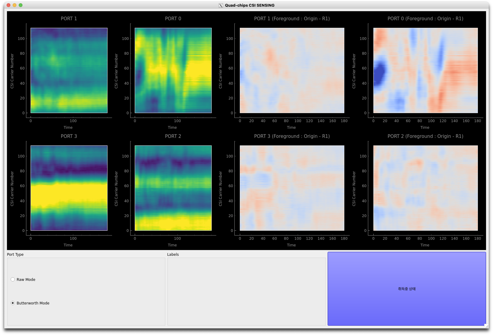

# 📡 Real-Time CSI Visualization & Human Activity Recognition System

This repository provides a **real-time CSI sensing system** that processes Wi-Fi Channel State Information (CSI) for multi-device visualization and deep learning-based human activity & location recognition. It supports **4 ESP devices** and applies **Butterworth filtering** to extract meaningful features for inference.

<div align="center">
  
</div>

---

## 🔧 Features

- 🧠 Real-time inference of both human activity and location (zone-based)
- 📊 Interactive PyQt5 GUI with real-time CSI heatmaps and multi-label outputs
- 🧼 Denoising pipeline using **Butterworth filtering**
- 🧮 Plug-and-play with **CNN or Transformer-based models**
- 📡 MQTT-based real-time CSI ingestion from **ESP32-S3 devices**
- 💾 Automatic timestamped data logging

---

## 🔧 Requirements

All required Python packages are listed in the `requirements.txt` file.  
Please install them by running:

```bash
pip install -r requirements.txt
```

> 💡 Make sure to check the `requirements.txt` file for the exact library versions used in this system.

---

## 🔗 Pretrained Weights

📦 Download `loc.pt` and `act.pt` to `csi/weight/esp01_weight/`

- [Location](https://drive.google.com/file/d/1t1Di4KkHQOpncNmZmSdYPAN-0ZtC8Yqc/view?usp=sharing)
- [Activity](https://drive.google.com/file/d/1reTq928hYPGpaUEugrAVeZoKxW_10U28/view?usp=sharing)

> 📁 If the folders do not exist, please create them manually.

---

## 🚀 How to Run

### 1. Set up MQTT

Edit `mqtt_config.py` to match your broker:
```python
BROKER_ADDRESS = "localhost"  # or your broker's IP
PORT = 1883
TOPIC = "csi/data"
```

### 2. Launch the system

```bash
python main.py --inf_sec 3 --model CNN --acquire
```

Arguments:
- `--inf_sec`: Inference time window in seconds (default: 3)
- `--model`: Model type (`CNN` or `Transformer`)
- `--acquire`: If provided, logs CSI data to file

---

## 🧑‍💻 Maintainer

**Taehyeon Kim, Ph.D.**  
Senior Researcher, Korea Electronics Technology Institute (KETI)  
📧 [taehyeon.kim@keti.re.kr](mailto:taehyeon.kim@keti.re.kr)  🌐 [Homepage](https://rcard.re.kr/detail/OISRzd7ua0tW0A1zMEwbKQ/information)

**Dongwoo Kang**  
Researcher, Korea Electronics Technology Institute (KETI)  
📧 [dongwookang@keti.re.kr](mailto:dongwookang@keti.re.kr) 

---

## 📜 License

This project is released under a custom license inspired by the MIT License. See [`LICENSE`](./LICENSE.txt) file for details.

⚠️ **Important Notice**  
Use of this code—commercial or non-commercial, including academic research, model training, product integration, and distribution—**requires prior written permission** from the author. Unauthorized usage will be treated as a license violation.
